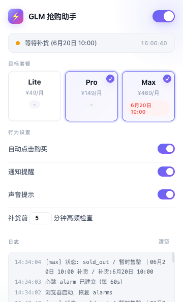

# 智谱 GLM5.2 Coding Plan 自动抢购助手 Chrome 扩展

智谱 GLM5.2 Coding Plan 自动抢购助手是一款用于监听 `bigmodel.cn` GLM Coding 套餐补货状态的 Chrome 扩展。它支持 Lite / Pro / Max 套餐多选监控，在目标套餐从「暂时售罄」变为可购买状态时自动提醒，并可按配置触发辅助点击流程。

> 核心定位：面向智谱 BigModel / GLM Coding Plan 套餐补货场景，可配合 **EasyBR / eBrower 指纹浏览器** 使用，实现多浏览器实例、多账号环境隔离、多窗口同时监控 GLM5.2 Coding Plan 套餐状态，适合需要同时盯多个套餐、多个账号或多个浏览器环境的场景。
>
> EasyBR / eBrower 相关链接：
>
> - 官网：[https://www.ebrower.com/](https://www.ebrower.com/)
> - API 文档：[https://www.ebrower.com/helperdoc/apidoc.html](https://www.ebrower.com/helperdoc/apidoc.html)

> 适用场景：GLM Coding 套餐经常短时间补货、售罄，用户希望减少手动刷新和错过补货窗口的情况。

## 界面预览



## 功能特性

- 支持监听 Lite / Pro / Max 目标套餐
- 可配合 EasyBR 指纹浏览器实现多浏览器实例同时运行
- 支持多账号、多环境隔离，避免不同登录态相互影响
- 可在多个浏览器窗口中分别加载扩展并监控不同套餐
- 通过 `fetch` / `XMLHttpRequest` hook 捕获库存相关接口响应
- 通过 `MutationObserver` 监听页面 DOM 变化
- 每 1 秒执行一次心跳扫描，兜底检查套餐卡片状态
- 可配置自动点击购买按钮
- 支持 Chrome 桌面通知和声音提示
- Popup 弹窗展示当前状态、目标套餐、配置项和实时日志

## 宣传视频

项目配套 Remotion 宣传视频位于本地 `work/glm-grabber-video`，可用于产品介绍、演示录屏和推广素材二次剪辑。

## 配合 EasyBR / eBrower 指纹浏览器多开

本扩展可以作为 EasyBR / eBrower 指纹浏览器里的 Chrome 扩展使用。

- 官网：[https://www.ebrower.com/](https://www.ebrower.com/)
- API 文档：[https://www.ebrower.com/helperdoc/apidoc.html](https://www.ebrower.com/helperdoc/apidoc.html)

每个 EasyBR 浏览器环境拥有独立指纹、独立 Cookie、独立登录态和独立扩展配置，因此可以实现：

- 一个浏览器环境监控 Max 套餐
- 一个浏览器环境监控 Pro 套餐
- 一个浏览器环境监控 Lite 套餐
- 多个账号分别登录 `bigmodel.cn`
- 多个窗口同时运行，互不干扰

推荐流程：

1. 在本项目中执行 `npm run build` 生成 `glmhelp/`。
2. 在 EasyBR 中创建一个或多个浏览器环境。
3. 在每个浏览器环境的扩展管理页面加载本项目的 `glmhelp/` 目录。
4. 分别登录不同 BigModel 账号，打开 `https://bigmodel.cn/glm-coding?plantype=personal`。
5. 在每个环境的扩展 Popup 中选择要监控的目标套餐。
6. 保持窗口运行，即可实现多浏览器、多账号、多套餐同时监控。

> 注意：多开只是提供隔离浏览器环境；是否开启自动点击、是否确认订单，仍应由用户根据目标网站规则和自身需求谨慎决定。

## 安全说明

本项目公开仓库只包含源码和静态资源，不包含：

- Chrome 扩展打包私钥 `*.pem`
- 已打包的 `glmhelp/` 目录
- `.crx` 安装包
- 浏览器登录态或本地 profile

请不要将自己的账号信息、Cookie、支付信息、Chrome profile 或私钥提交到仓库。

## 目录结构

```text
.
├── manifest.json           # Chrome MV3 manifest
├── build.js                # 简易打包脚本，生成 glmhelp/
├── src/
│   ├── background.js       # service worker，状态/日志/通知
│   ├── content.js          # 页面扫描、DOM 监听、点击流程
│   ├── inject.js           # fetch/XHR hook
│   ├── popup.html          # 扩展弹窗
│   ├── popup.css
│   ├── popup.js
│   ├── constants.js
│   ├── utils.js
│   └── notify.wav
├── icons/                  # 扩展图标
├── test/                   # 逻辑测试和 fixture
├── start.sh                # macOS 下启动带扩展的 Chrome
└── stop.sh                 # 停止专用 Chrome profile
```

## 安装依赖

```bash
npm install
```

## 运行测试

```bash
npm test
```

测试覆盖核心纯逻辑：

- 按钮状态分类 `sold_out` / `available` / `busy` / `unknown`
- 补货时间解析
- 套餐卡片扫描

## 构建扩展

```bash
npm run build
```

构建后会生成：

```text
glmhelp/
├── manifest.json
├── background.js
├── content.js
├── inject.js
├── popup.html
├── popup.css
├── popup.js
├── notify.wav
└── icons/
```

## 在 Chrome 中加载

### 方式一：手动加载

1. 执行构建：

   ```bash
   npm run build
   ```

2. 打开 Chrome：

   ```text
   chrome://extensions/
   ```

3. 打开右上角「开发者模式」
4. 点击「加载已解压的扩展程序」
5. 选择本项目生成的 `glmhelp/` 目录

### 方式二：macOS 启动脚本

```bash
npm run build
npm run start
```

脚本会使用独立 Chrome profile：

```text
~/glm-snipe-browser
```

停止：

```bash
npm run stop
```

## 使用方法

1. 构建并加载扩展
2. 打开 `https://bigmodel.cn/glm-coding?plantype=personal`
3. 点击 Chrome 工具栏中的扩展图标
4. 在 Popup 中选择目标套餐 Lite / Pro / Max
5. 根据需要开启自动点击、通知、声音提示
6. 保持页面打开，扩展会持续监听套餐状态

## 工作原理

扩展使用三路机制提高补货感知速度：

1. **接口响应捕获**：`inject.js` hook `fetch` 和 `XMLHttpRequest`，观察库存相关 API 响应。
2. **DOM 变化监听**：`content.js` 使用 `MutationObserver`，页面套餐按钮变化后立即重新扫描。
3. **心跳兜底扫描**：定时执行 `scanCards()`，避免漏掉未触发明显 DOM 变化的状态更新。

当目标套餐按钮从售罄状态变为可购买状态时，扩展会根据配置执行提醒或点击流程。

## 免责声明

本项目仅用于学习 Chrome Extension、页面状态监听和自动化提醒机制。请遵守目标网站服务条款，谨慎使用自动点击功能。任何账号、支付、订单相关操作都应由用户自行确认并承担责任。

## License

MIT
